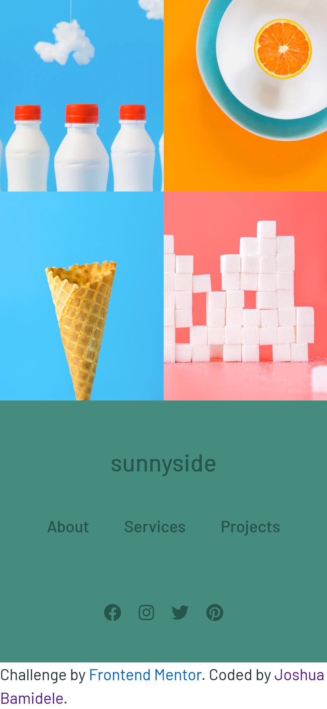

# Sunnyside-Agency-Landing-Page-Josh
# Frontend Mentor - Sunnyside agency landing page solution

This is a solution to the [Sunnyside agency landing page challenge on Frontend Mentor](https://www.frontendmentor.io/challenges/sunnyside-agency-landing-page-7yVs3B6ef). Frontend Mentor challenges help you improve your coding skills by building realistic projects.

## Table of contents

- [Overview](#overview)
  - [The challenge](#the-challenge)
  - [Screenshot](#screenshot)
  - [Links](#links)
- [My process](#my-process)
  - [Built with](#built-with)
  - [What I learned](#what-i-learned)
  - [Continued development](#continued-development)
  - [Useful resources](#useful-resources)
- [Author](#author)
- [Acknowledgments](#acknowledgments)

## Overview

### The challenge

Users should be able to:

- View the optimal layout for the site depending on their device's screen size
- See hover states for all interactive elements on the page

### Screenshot

 
 
 

### Links

- Solution URL: [Add solution URL here](https://your-solution-url.com)
- Live Site URL: [Add live site URL here](https://your-live-site-url.com)

## My process

### Built with

- Semantic HTML5 markup
- CSS custom properties
- Flexbox
- CSS Grid

### What I learned

I learnt how to use CSS Grid perfectly well without the use of external frameworks like Bootstrap, e.t.c. 

I know what flexbox is tho. But in general, this project made me more comfortable with flexbox and it was like a challenge to test my flexbox skills. Now I can consider myself as a flexbox King. LOL 

I also learnt new tricks about mobile responsive design as well.  

### Continued development

What next after this project? I will like to continue focusing on building more web apps with Next JS or React JS and also how to interact with third party web api as well. 

## Author

- Github - [Joshardals] ("https://github.com/Joshardals")
- Frontend Mentor - [@joshardals](https://www.frontendmentor.io/profile/yourusername)
- Twitter - [@Joshardals](https://www.twitter.com/joshardals
